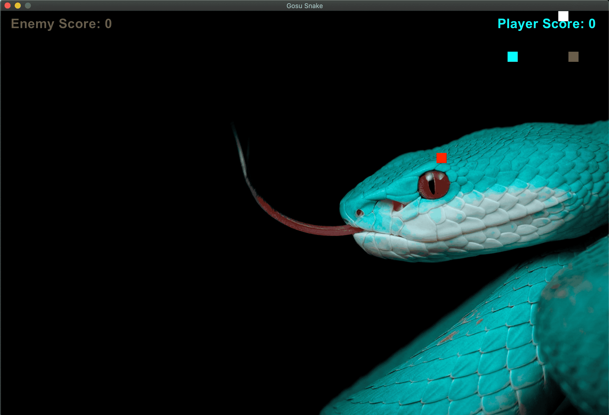

# Snake-with-Gosu
Snake game with double snakes, no walls and spawning obstacles, built with Gosu library for Ruby



I wrote this little app during my second week of LeWagon bootcamp.
To play the game you need to install the SDL 2 library (https://www.libsdl.org/)

```shell
brew update
brew install sdl2
gem install gosu
```

I took a basic game of Snake from https://github.com/samthuang/gosu-snake/blob/master/README.md, and implemented some extra features such as:
  - an enemy snake
  - no walls --> snakes can pass from one side of the screen to the other
  - obstacles spawning randomly as you eat food

It's a very simple game but I'm proud of the result!
